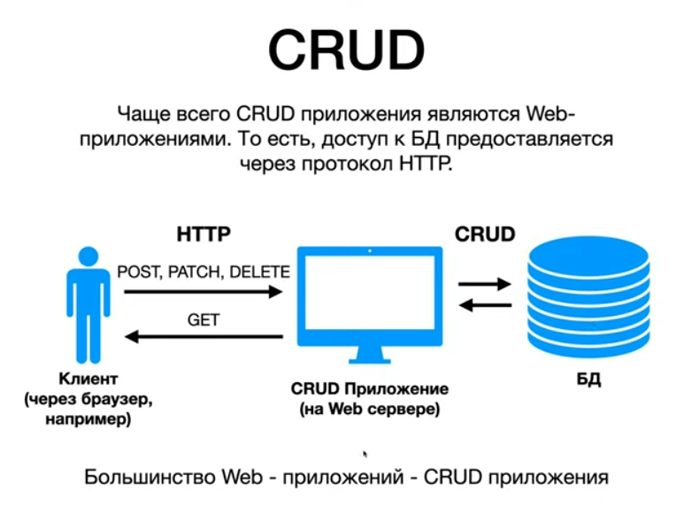
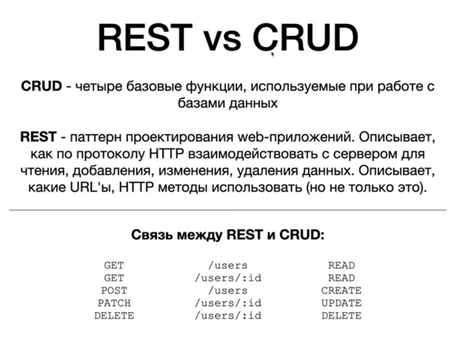

## CRUD Spring Boot приложение с REST API

Проект использует и работает с:

- OS: Linux (Ubuntu 21.04) 64-bits;
- IDEA Community Edition;
- Spring Boot 2.7.4;
- Maven build tools;
- Java 17; 
- .jdks/corretto-17.0.5/bin/java.

Запуск:
- открыть проект в IDEA;
- набрать Alt + Shift + F10
- после сборки открыть страницу браузера: http://localhost:8080

Для создания зависимостей использовался сайт:

	https://start.spring.io/

Параметры:

- Project: Maven Project;
- Language: Java;
- Spring Boot: 2.7.4;
- Java: 17.

Список зависимостей:

- Spring Boot DevTools;
- Spring Web;
- Rest Repositories;
- Rest Repositories HAL Explorer;
- H2 Database;
- Spring Data JPA.

После набирания нужных зависимостей и указания нужных пунктов нужно было сгенерировать архив (jar): Generate.
Сохранить-разархивировать-открыть на компьютере и внести нужные изменения для работы (доп.классы).

Материалы:
<html></html>
<html></html>
Дополнительный материал по теории:
<html></html>

Ссылки:

"КАК СОЗДАТЬ CRUD REST API БЫСТРО?"
https://www.youtube.com/watch?v=146ki-Gb8Tg

Tags: Spring, Spring Boot, CRUD, REST