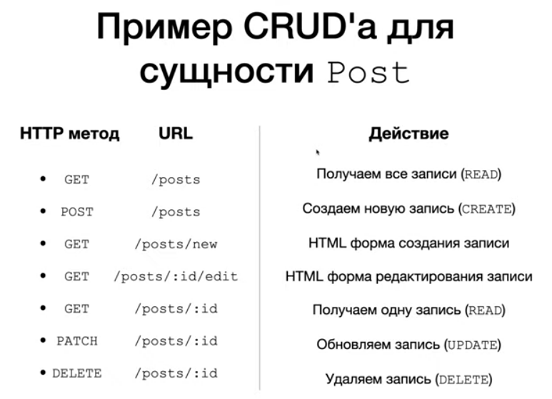

## CRUD Spring Boot приложение с REST API

Проект использует и работает с:

- OS: Linux (Ubuntu 21.04) 64-bits;
- IDEA Community Edition;
- Spring Framework;
- Maven build tools;
- Java 8 (JDK 1.8: java-1.8.0-openjdk-amd64);
- .jdks/corretto-17.0.5/bin/java.

Запуск:
- открыть проект в IDEA;
- набрать Alt + Shift + F10
- после сборки открыть страницу браузера: http://localhost:8080

Материалы:
<html></html>
<html></html>
Дополнительный материал по теории:
<html></html>

Ссылки:

"КАК СОЗДАТЬ CRUD REST API БЫСТРО?"
https://www.youtube.com/watch?v=146ki-Gb8Tg

Tags: Spring, Spring Boot, CRUD, REST